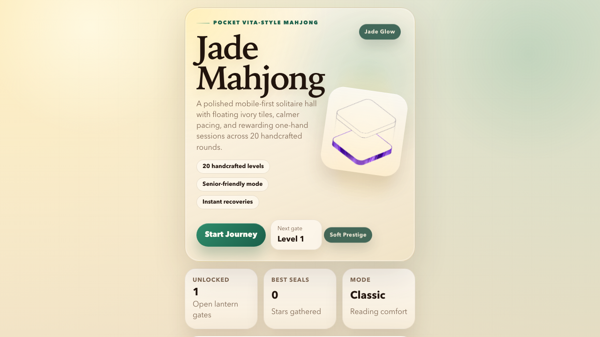
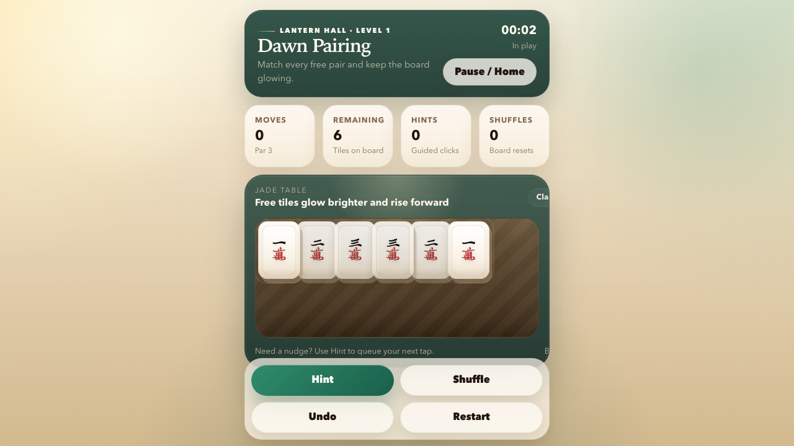
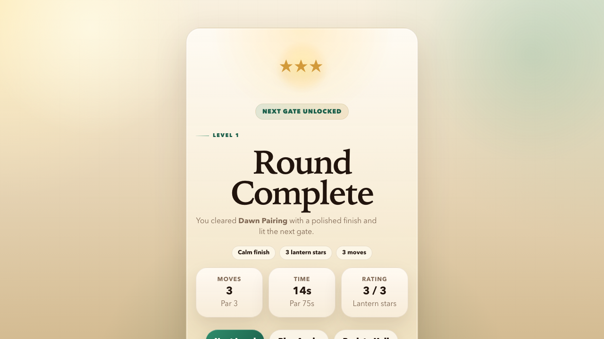

# Jade Mahjong

Mobile-first mahjong solitaire built with React, TypeScript, and Vite.

这是一个适合公开展示与直接部署的麻将连连看 Web 项目，重点不是复杂规则堆叠，而是把“可玩、可解、易读、移动端友好”的核心体验做扎实。

## 项目亮点

- 20 个手工配置关卡，支持持续解锁
- 移动端优先布局，单手操作更自然
- `Hint`、`Shuffle`、`Smart Recovery`、`Undo`、`Restart` 全套对局辅助
- `Senior Mode` 大字号/大牌面，提升可读性
- 本地进度存储，无需后端即可完整游玩
- 内置测试、Lint 与生产构建流程

## 适合什么场景

- 作为一个可直接运行和展示的前端作品集项目
- 作为轻量游戏交互、状态管理、规则引擎的参考实现
- 作为后续部署到 Vercel 的静态 Web App 基础模板

## 界面预览

### 首页



### 对局界面



### 结算界面



## 核心功能

### 首页大厅

- 从当前已解锁关卡继续开始
- 查看 20 个关卡的解锁状态与最佳星级
- 切换 `Senior Mode`
- 控制提示高亮与声音预留开关

### 对局页

- 点击自由牌完成配对消除
- `Hint` 自动准备下一步可执行配对
- `Shuffle` 仅打散当前自由牌
- `Smart Recovery` 在停局时重新整理剩余活跃牌
- `Undo` 恢复到上一步快照
- `Restart` 重新开始当前关卡

### 结果页

- 展示当前关卡的步数、用时、星级
- 自动解锁下一关
- 支持继续下一关、重开本关或回到大厅

## 玩法说明

### 什么是自由牌

只有满足以下条件的牌才可点击：

- 上方没有更高层的牌覆盖
- 左右至少一侧是开放的

### 如何完成匹配

- 两张牌都必须是自由牌
- 两张牌必须属于同一牌型
- 匹配成功后会一起移除

### 对局状态

- `playing`：还有可执行匹配
- `stalled`：仍有剩余牌，但当前没有可匹配对
- `won`：所有牌都已清除

### 星级规则

每关基础 1 星，额外星级来自：

- 步数不高于该关 `parMoves`
- 用时不高于该关 `parTimeSec`

最高 3 星。

## 与普通 demo 的差异

这个项目不是只做“能点、能消”的最小演示，而是把完整游玩闭环补齐了：

- 关卡不是随机乱铺，而是以“保持可解”为前提生成初始布局
- `Hint` 不只是告诉你“有牌可消”，而是直接准备下一步操作
- 停局后可以用 `Smart Recovery` 恢复成可继续推进的局面
- 解锁进度、最佳成绩、设置项都会持久化到本地

## 技术栈

- React 19
- TypeScript
- Vite
- Vitest
- ESLint
- `localStorage` 持久化

## 目录结构

```text
.
├── README.md                 # 仓库总览与部署说明
├── docs/
│   └── screenshots/          # README 使用的界面截图
└── app/
    ├── README.md             # 开发者视角补充说明
    ├── public/               # favicon 与静态资源
    ├── src/
    │   ├── components/       # 可复用 UI 组件
    │   ├── data/             # 牌型元数据与关卡配置
    │   ├── game/             # 核心规则引擎与测试
    │   ├── screens/          # 首页、对局、结果页
    │   ├── storage/          # 本地进度存储
    │   ├── test/             # 测试初始化
    │   └── types/            # 共享类型定义
    ├── package.json
    └── vite.config.ts
```

## 本地开发

项目真正的前端应用位于 `app/` 目录，请先进入该目录再执行命令。

```bash
cd app
npm install
```

启动开发环境：

```bash
npm run dev
```

运行测试：

```bash
npm test
```

运行 Lint：

```bash
npm run lint
```

生产构建：

```bash
npm run build
```

## 部署到 Vercel

这是一个标准的 Vite 静态项目。当前仓库根目录已经提供了 `vercel.json`，所以直接从 GitHub 导入后，Vercel 也会自动进入 `app/` 安装并构建。

如果你想手动配置，推荐参数如下：

- Root Directory：`app`
- Install Command：`npm install`
- Build Command：`npm run build`
- Output Directory：`dist`

如果你已经创建过一个 Vercel Project 且它之前部署成了 404，请二选一修正：

- 保持 Root Directory 为仓库根目录，并重新部署，让新的 `vercel.json` 生效
- 或者把 Root Directory 改成 `app/`，再重新部署

## 已验证内容

- 全部 20 个关卡具备连续通关路径
- 自由牌判定与匹配逻辑
- `Hint`、`Shuffle`、`Smart Recovery`、`Undo`
- 本地进度存储与解锁逻辑
- Lint、测试、生产构建流程

## 文档索引

更细的交付记录与验证说明位于：

- [面试提交说明](docs/submission-note.md)：专门回应本次测试题的评估重点，说明 AI 工具使用方式、独立解决问题能力，以及我对游戏体验的判断与取舍。
- [项目总结](docs/project-summary.md)：概述整体实现思路、开发过程中遇到的问题、解决方案，以及宝牌机制带来的产品创新。
- [产品 PRD](docs/product-prd.md)：从产品视角描述目标用户、核心体验、功能范围、差异化设计与成功标准。
- [技术 Spec](docs/technical-spec.md)：从工程视角描述模块结构、核心类型、规则引擎、宝牌/连击系统与持久化方案。
- [交付总结](app/docs/submission-summary.md)：总结本次交付范围、技术选择、关键问题与阶段性验证结果。
- [核心工作记录](app/docs/2026-04-04-core-work.md)：记录首轮关键优化内容，包括开局牌型分布和 Hint 交互改造。
- [决策与思考记录](app/docs/2026-04-04-decision-log.md)：说明主要方案取舍、约束条件与实现时的关键判断。
- [验证与发布记录](app/docs/2026-04-04-validation-log.md)：记录测试、Lint、构建与发布相关的验证结果。

## 公开仓库说明

- 当前仓库适合直接公开展示与部署
- 未发现后端密钥、环境变量或账户凭证泄露
- 这是一个纯前端项目，不依赖额外服务端接口

## 后续可以继续迭代的方向

- 增加在线 Demo 地址
- 引入音效与更细的交互动效
- 支持可复现的种子化牌局
- 增加更多难度层和牌面主题
- 继续优化移动端触控反馈与 PWA 安装体验

## License

当前仓库尚未附带单独的 `LICENSE` 文件。若你准备长期公开维护，建议在正式对外推广前补充许可证说明。
